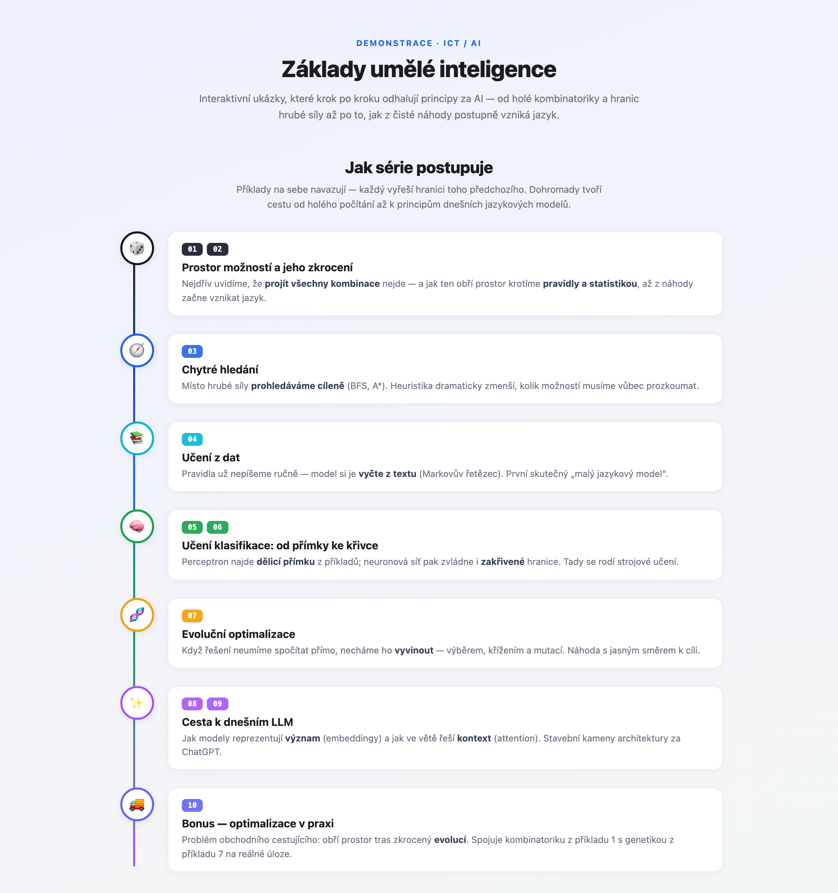
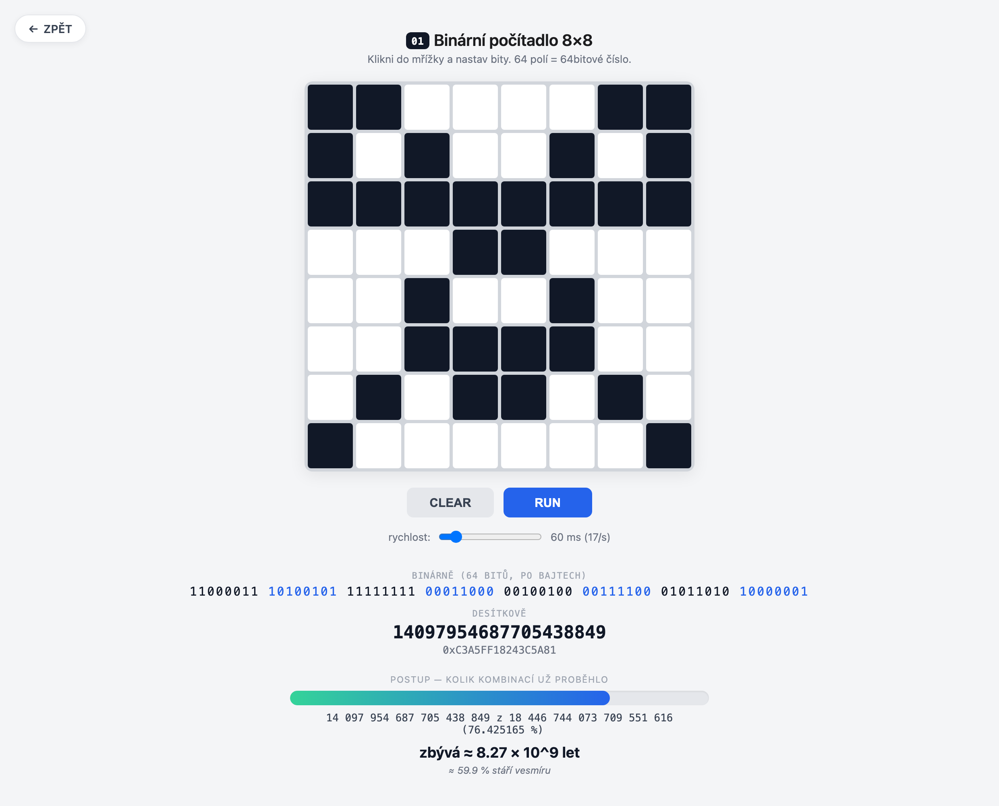
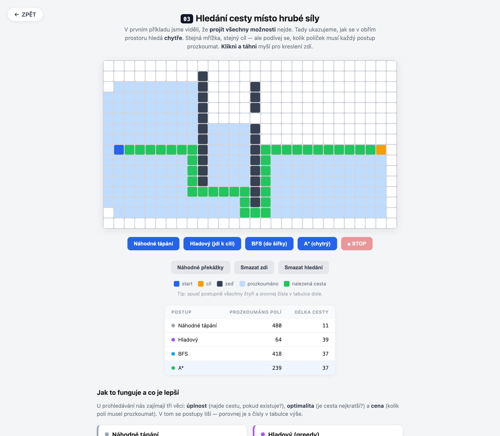
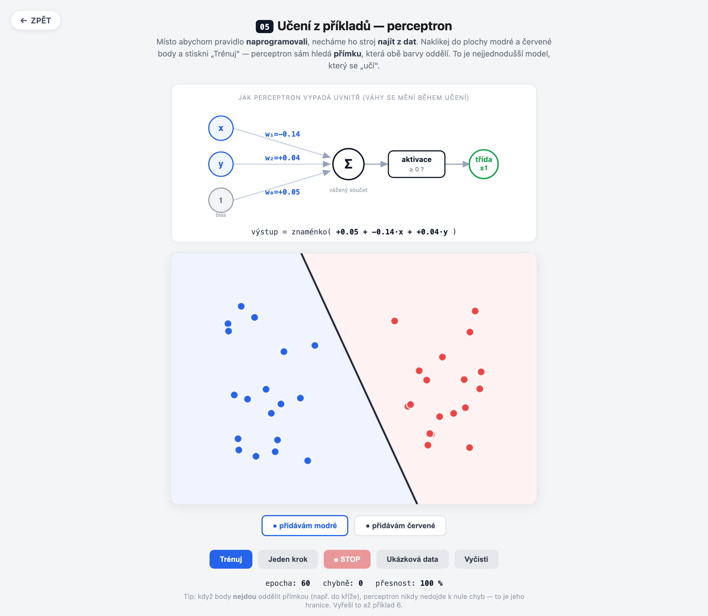
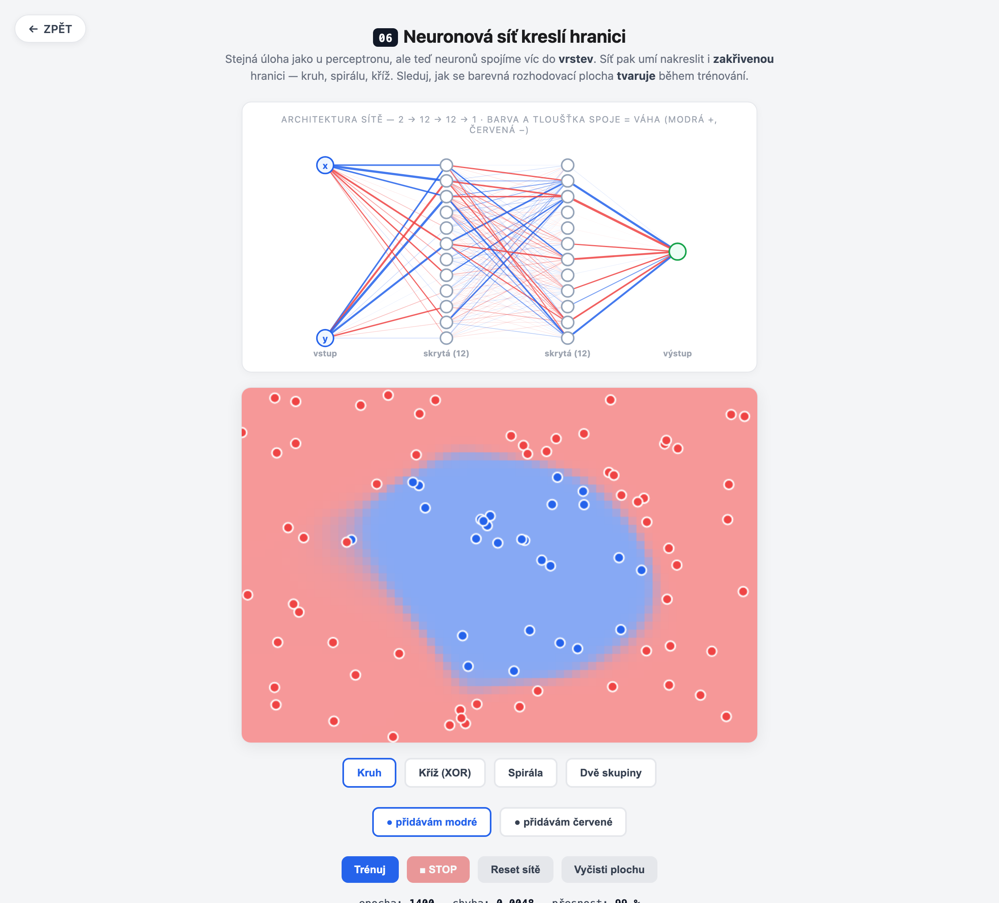

<a id="english"></a>
# Foundations of Artificial Intelligence — interactive demos

🇬🇧 **English** &nbsp;·&nbsp; 🇨🇿 **[Česky ↓](#česky)**

A set of interactive demonstrations in plain HTML/JavaScript that **reveal the principles behind AI step by step** — from bare combinatorics and the limits of brute force to how today's language models represent meaning and context.

No libraries, no installation. Just open **[`index.html`](index.html)** in a browser and click through the demos.

> 🌐 **Bilingual:** the site is in **Czech by default**; switch to **English** with the flags in the top-right corner of any page (your choice is remembered, and `?lang=en` deep-links it).

### 🌐 Live version: **[www.saiko.cz/ai](https://www.saiko.cz/ai/)**



---

## How to run it

- **Online:** open **[www.saiko.cz/ai](https://www.saiko.cz/ai/)**.
- **Locally:**
  1. Download / clone this folder.
  2. Open **`index.html`** in any modern browser (Chrome, Safari, Firefox, Edge).
  3. Click the examples in the overview. Each has a **← BACK** button in the top-left and a 🇨🇿/🇬🇧 language toggle in the top-right.

> Everything runs locally in the browser; nothing is sent anywhere.

---

## How the series progresses

The examples build on each other — each one solves the limitation of the previous:

| Stage | Examples | What it's about |
|------|----------|-------------|
| 🎲 The space of possibilities and taming it | 01, 02 | Going through every combination is impossible — rules and statistics tame the vast space |
| 🧭 Smart search | 03 | Instead of brute force we search deliberately (BFS, A\*) |
| 📚 Learning from data | 04 | We no longer write rules by hand; the model reads them from text |
| 🧠 Learning to classify | 05, 06 | From a separating line (perceptron) to a curve (neural network) |
| 🧬 Evolutionary optimization | 07 | We let the solution "evolve" through selection, crossover and mutation |
| ✨ The road to today's LLMs | 08, 09 | How models represent meaning (embeddings) and context (attention) |
| ✍️ How an LLM writes | 10 | Generating text token by token: probabilities, sampling, temperature/top-k/top-p, hallucination |
| 🚚 Bonus — optimization in practice | 11 | The travelling salesman problem solved by evolution (joins 01 and 07) |

---

## The examples

### 01 · Binary counter 8×8
[→ open `01-binary-counter.html`](01-binary-counter.html)



A grid of 64 cells as a single 64-bit number. Click to set bits and press RUN to count up. The remaining-time graph shows why "trying every combination" by brute force **never finishes** — even at thousands of steps per second it's tens of billions of years (longer than the age of the universe). The perfect motivation for why we don't use brute force in AI.

---

### 02 · From randomness to language
[→ open `02-jazyk.html`](02-jazyk.html)


Four steps **A–D** as a mini-history of language models: from combinatorially iterated random letters, through statistics (a pseudo-language with syllables) and a dictionary (real words with no meaning) to grammatically correct, meaningful sentences. By gradually adding rules, noise turns into language.

---

### 03 · Pathfinding instead of brute force
[→ open `03-hledani.html`](03-hledani.html)



A grid maze (draw walls with the mouse) and a contest of methods: **random walk, greedy, BFS and A\***. You see for yourself how many cells each one explores — and a comparison table shows why brute force gives way to smart search (A\* finds a path as short as BFS but explores orders of magnitude fewer cells).

---

### 04 · Learning from text — a Markov chain
[→ open `04-markov.html`](04-markov.html)


The first demo of **real learning from data**: the model computes from your text what most often follows what, and generates new text from those probabilities. With the context-order slider you watch gibberish turn into almost-real language — the principle of a "small language model".

---

### 05 · Learning from examples — a perceptron
[→ open `05-perceptron.html`](05-perceptron.html)



You click two colors of points and the perceptron finds a **separating line** on its own. The neuron diagram above the canvas shows the weights changing live during learning. It demonstrates the difference between "programming a rule" and "letting it be found from data" — and the limit of a linear model (a cross/XOR is too much for it).

---

### 06 · A neural network draws the boundary
[→ open `06-neuronka.html`](06-neuronka.html)



A sequel to #5: a network of neurons (2 → 12 → 12 → 1) handles a **curved** boundary too — a circle, a cross, a spiral. The network diagram colors the connections by their current weights (blue +, red −), so you see the network "rewire" during training. You click in your own data.

---

### 07 · Genetic algorithm
[→ open `07-genetika.html`](07-genetika.html)


A population of random sentences **evolves toward a target** generation by generation through crossover and mutation. It shows how to search for a solution without knowing it — you only need to be able to score how good it is. It links the randomness of examples 1 and 2 with evolution toward meaning.

---

### 08 · Tokenization and embeddings
[→ open `08-embeddingy.html`](08-embeddingy.html)


How an LLM "sees" text: chopping it into **tokens** (with IDs from a vocabulary) and a 2D **map of meaning** where similar words lie close. Including computing with meaning — analogies like **king − man + woman = queen** or **two − one + three = four**, drawn as vectors on the map.

---

### 09 · Attention — what the model looks at
[→ open `09-attention.html`](09-attention.html)


Click a word in a sentence and see how much **attention** it pays to the others — as a percentage and color saturation, plus the whole attention map (a matrix). A simplified but vivid visualization of the mechanism behind today's transformers (the architecture behind ChatGPT).

---

### 10 · How an LLM writes — next-token prediction
[→ open `10-token.html`](10-token.html)


Real language models don't blurt out a finished answer — they write it **token by token**. At each step the model computes a probability for every possible next word and **samples** one. This demo shows that step live: a probability bar chart, an editable prompt, and **temperature / top-k / top-p** controls that change how boldly it samples — with a small built-in word model (like the Markov chain in 04) under the hood. It also shows **why models hallucinate**: even when unsure (a flat distribution or an unknown context) the model still confidently picks something. The synthesis of the LLM arc — meaning (08) + context (09) → generation.

---

### 11 · The travelling salesman problem (TSP) — bonus
[→ open `11-tsp.html`](11-tsp.html) · [app ↗](https://saiko.cz/tsp/) · [source code ↗](https://github.com/dsaiko/tsp)


A bonus card with an embedded older project: a **TSP visualizer that solves the shortest route through all the cities with a genetic algorithm** right in the browser. It joins two principles of this series — **combinatorial explosion** (there are `(n−1)!/2` routes, going through them all is impossible) and **evolution** (a population of routes crosses over and mutates toward better ones), plus the **2-opt** heuristic (uncrossing edges). Built in TypeScript + Canvas + Web Workers, 12 maps including real Czech cities. It's a modernized rewrite of the original Java app from 2006.

---

## Implementation notes

- **No dependencies** — each example is a single standalone `.html` file with embedded CSS and JavaScript.
- **Bilingual in one file** — Czech and English content live side by side; a flag toggle (top-right) switches them instantly with no reload, and the choice is saved to `localStorage`. You can deep-link a language with `?lang=en` / `?lang=cs`.
- **Exact arithmetic** — the counter in example 1 uses `BigInt`, because a normal JS number is only exact up to 53 bits.
- **From-scratch implementations** — the neural network (incl. backpropagation), the Markov chain, A\*/BFS, the genetic algorithm and attention are all written from the ground up, without ML libraries, so the principle is visible in the code.
- Examples 08 and 09 are **simplified illustrations** of the mechanisms (embeddings projected into 2D, illustrative attention), not trained models — they're meant to convey the principle.

---

## Deployment

The site is static; it's deployed to S3 + CloudFront via the `Makefile` (configuration in `Makefile.local`, outside git):

```bash
make build              # assembles dist/ from *.html
make preview            # local preview at http://localhost:8080
make deploy             # build → sync to S3 → CloudFront invalidation
make deploy-s3-dryrun   # deploy dry run
```

---

*SSST 2026 · ICT / AI · [www.saiko.cz/ai](https://www.saiko.cz/ai/)*

---

<a id="česky"></a>
# Základy umělé inteligence — interaktivní ukázky

🇨🇿 **Česky** &nbsp;·&nbsp; 🇬🇧 **[English ↑](#english)**

Sada interaktivních demonstrací v čistém HTML/JavaScriptu, které **krok po kroku odhalují principy za AI** — od holé kombinatoriky a hranic hrubé síly až po to, jak dnešní jazykové modely reprezentují význam a kontext.

Žádné knihovny, žádná instalace. Stačí otevřít **[`index.html`](index.html)** v prohlížeči a proklikat se ukázkami.

> 🌐 **Dvojjazyčné:** web je **výchozí v češtině**; na **angličtinu** přepneš vlajkami v pravém horním rohu každé stránky (volba se pamatuje, případně ji nastaví `?lang=en`).

### 🌐 Živá verze: **[www.saiko.cz/ai](https://www.saiko.cz/ai/)**


---

## Jak to spustit

- **Online:** otevři **[www.saiko.cz/ai](https://www.saiko.cz/ai/)**.
- **Lokálně:**
  1. Stáhni / naklonuj tuto složku.
  2. Otevři **`index.html`** v libovolném moderním prohlížeči (Chrome, Safari, Firefox, Edge).
  3. Klikej v rozcestníku na jednotlivé příklady. Každý má vlevo nahoře tlačítko **← ZPĚT** a vpravo nahoře přepínač jazyka 🇨🇿/🇬🇧.

> Vše běží lokálně v prohlížeči, nic se nikam neodesílá.

---

## Jak série postupuje

Příklady na sebe navazují — každý vyřeší hranici toho předchozího:

| Etapa | Příklady | O čem to je |
|------|----------|-------------|
| 🎲 Prostor možností a jeho zkrocení | 01, 02 | Projít všechny kombinace nejde — pravidla a statistika obří prostor krotí |
| 🧭 Chytré hledání | 03 | Místo hrubé síly prohledáváme cíleně (BFS, A\*) |
| 📚 Učení z dat | 04 | Pravidla už nepíšeme ručně, model si je vyčte z textu |
| 🧠 Učení klasifikace | 05, 06 | Od dělicí přímky (perceptron) ke křivce (neuronová síť) |
| 🧬 Evoluční optimalizace | 07 | Řešení necháme „vyvinout" výběrem, křížením a mutací |
| ✨ Cesta k dnešním LLM | 08, 09 | Jak modely reprezentují význam (embeddingy) a kontext (attention) |
| ✍️ Jak LLM píše | 10 | Generování textu token po tokenu: pravděpodobnosti, vzorkování, teplota/top-k/top-p, halucinace |
| 🚚 Bonus — optimalizace v praxi | 11 | Problém obchodního cestujícího řešený evolucí (spojuje 01 a 07) |

---

## Příklady

### 01 · Binární počítadlo 8×8
[→ otevřít `01-binary-counter.html`](01-binary-counter.html)


Mřížka 64 polí jako jedno 64bitové číslo. Klikáním nastavíš bity a tlačítkem RUN je necháš přičítat. Graf zbývajícího času ukazuje, proč „projít všechny kombinace" hrubou silou **nikdy nedoběhne** — i při tisících kroků za sekundu jde o desítky miliard let (víc než stáří vesmíru). Ideální motivace, proč v AI hrubou silu nepoužíváme.

---

### 02 · Od náhody k jazyku
[→ otevřít `02-jazyk.html`](02-jazyk.html)


Čtyři kroky **A–D** jako mini-historie jazykových modelů: od kombinatoricky iterovaných náhodných písmen, přes statistiku (pseudojazyk se slabikami) a slovník (skutečná slova bez smyslu) až po gramaticky správné, smysluplné věty. Postupným přidáváním pravidel se z šumu stává jazyk.

---

### 03 · Hledání cesty místo hrubé síly
[→ otevřít `03-hledani.html`](03-hledani.html)


Bludiště na mřížce (zdi kreslíš myší) a souboj postupů: **náhodné tápání, hladový, BFS a A\***. Vidíš na vlastní oči, kolik políček každý prozkoumá — a srovnávací tabulka ukáže, proč se hrubá síla nahrazuje chytrým prohledáváním (A\* najde stejně krátkou cestu jako BFS, ale prozkoumá řádově méně).

---

### 04 · Učení z textu — Markovův řetězec
[→ otevřít `04-markov.html`](04-markov.html)


První ukázka **skutečného učení z dat**: model si z vloženého textu spočítá, co po čem nejčastěji následuje, a podle těch pravděpodobností generuje nový text. Posuvníkem řádu kontextu uvidíš, jak z blábolu vzniká skoro čeština — princip „malého jazykového modelu".

---

### 05 · Učení z příkladů — perceptron
[→ otevřít `05-perceptron.html`](05-perceptron.html)


Naklikáš dvě barvy bodů a perceptron sám hledá **dělicí přímku**. Schéma neuronu nad plochou ukazuje živě se měnící váhy během učení. Demonstruje rozdíl mezi „naprogramovat pravidlo" a „nechat ho najít z dat" — i hranici lineárního modelu (na kříž/XOR nestačí).

---

### 06 · Neuronová síť kreslí hranici
[→ otevřít `06-neuronka.html`](06-neuronka.html)


Pokračování pětky: síť neuronů (2 → 12 → 12 → 1) zvládne i **zakřivenou** hranici — kruh, kříž, spirálu. Schéma sítě barví spoje podle aktuálních vah (modrá +, červená −), takže vidíš, jak se síť během tréninku „přepojuje". Vlastní data si naklikáš sám.

---

### 07 · Genetický algoritmus
[→ otevřít `07-genetika.html`](07-genetika.html)


Populace náhodných vět se křížením a mutací generaci po generaci **vyvíjí k cíli**. Ukazuje, jak hledat řešení, aniž bychom ho znali — stačí umět ohodnotit, jak je dobré. Propojuje náhodu z příkladů 1 a 2 s evolucí směrem ke smyslu.

---

### 08 · Tokenizace a embeddingy
[→ otevřít `08-embeddingy.html`](08-embeddingy.html)


Jak LLM „vidí" text: rozsekání na **tokeny** (s ID ze slovníku) a 2D **mapa významů**, kde podobná slova leží blízko. Včetně počítání s významy — analogie jako **král − muž + žena = královna** nebo **dva − jedna + tři = čtyři**, vykreslené jako vektory na mapě.

---

### 09 · Attention — na co se model dívá
[→ otevřít `09-attention.html`](09-attention.html)


Klikni na slovo ve větě a uvidíš, kolik **pozornosti** věnuje ostatním — jako procenta a sytost barvy, plus celá mapa pozornosti (matice). Zjednodušená, ale názorná vizualizace mechanismu, na kterém stojí dnešní transformery (architektura za ChatGPT).

---

### 10 · Jak LLM píše — predikce dalšího tokenu
[→ otevřít `10-token.html`](10-token.html)


Skutečné jazykové modely nevyhrknou hotovou odpověď — píšou ji **token po tokenu**. V každém kroku spočítají pravděpodobnost pro každé možné další slovo a jedno **losují**. Ukázka to zobrazí naživo: sloupcový graf pravděpodobností, editovatelný začátek věty a ovládání **teploty / top-k / top-p**, které mění, jak odvážně model losuje — pod kapotou běží malý slovní model (jako Markov ve 4). Zároveň ukazuje, **proč modely halucinují**: i když si není jistý (ploché rozdělení nebo neznámý kontext), model stejně sebevědomě něco vybere. Vyvrcholení linie o LLM — význam (08) + kontext (09) → generování.

---

### 11 · Problém obchodního cestujícího (TSP) — bonus
[→ otevřít `11-tsp.html`](11-tsp.html) · [aplikace ↗](https://saiko.cz/tsp/) · [zdrojový kód ↗](https://github.com/dsaiko/tsp)


Bonusová karta s vloženým starším projektem: **vizualizér TSP řešící nejkratší trasu přes všechna města genetickým algoritmem** přímo v prohlížeči. Spojuje dva principy z této série — **kombinatorickou explozi** (tras je `(n−1)!/2`, projít všechny nejde) a **evoluci** (populace tras se kříží a mutuje k lepšímu), doplněnou o heuristiku **2-opt** (odkřížení hran). Postaveno v TypeScriptu + Canvas + Web Workers, 12 map včetně reálných českých měst. Je to modernizovaný přepis původní Java aplikace z roku 2006.

---

## Poznámky k implementaci

- **Bez závislostí** — každý příklad je jeden samostatný `.html` soubor s vloženým CSS a JavaScriptem.
- **Dvojjazyčné v jednom souboru** — česká i anglická verze jsou vedle sebe; přepínač s vlajkami (vpravo nahoře) je přepne okamžitě bez načítání stránky a volba se uloží do `localStorage`. Jazyk lze předvolit i přes `?lang=en` / `?lang=cs`.
- **Přesná aritmetika** — počítadlo v příkladu 1 používá `BigInt`, protože běžné JS číslo je přesné jen do 53 bitů.
- **Vlastní implementace** — neuronová síť (vč. backpropagation), Markovův řetězec, A\*/BFS, genetický algoritmus i attention jsou napsané od základu, bez ML knihoven, aby šel princip vidět v kódu.
- Ukázky 08 a 09 jsou **zjednodušené ilustrace** mechanismů (embeddingy promítnuté do 2D, ilustrativní attention), ne natrénované modely — slouží k pochopení principu.

---

## Nasazení

Web je statický, nasazuje se na S3 + CloudFront pomocí `Makefile` (konfigurace v `Makefile.local`, mimo git):

```bash
make build              # poskládá dist/ z *.html
make preview            # lokální náhled na http://localhost:8080
make deploy             # build → sync na S3 → invalidace CloudFront
make deploy-s3-dryrun   # zkouška deploye nanečisto
```

---

*SSST 2026 · ICT / AI · [www.saiko.cz/ai](https://www.saiko.cz/ai/)*
