<a id="english"></a>
# Foundations of Artificial Intelligence — interactive demos

🇬🇧 **English** &nbsp;·&nbsp; 🇨🇿 **[Česky ↓](#česky)**

A set of interactive demonstrations in plain HTML/JavaScript that **reveal the principles behind AI step by step** — in 20 chapters, from bare combinatorics and the limits of brute force through learning from data, images and reward to how today's language models, RAG and agents work. They are made to be shown live in class: each chapter ends with a bit of history, "What's next?" and questions for discussion.

The demos are plain HTML/CSS/JS, assembled into self-contained static pages with **[Astro](https://astro.build)**. Visit the **[live site](https://www.saiko.cz/ai/)**, or build from source (see below).

> 🌐 **Bilingual:** the site is in **Czech by default**; switch to **English** with the flags in the top-right corner of any page (your choice is remembered, and `?lang=en` deep-links it).

### 🌐 Live version: **[www.saiko.cz/ai](https://www.saiko.cz/ai/)**

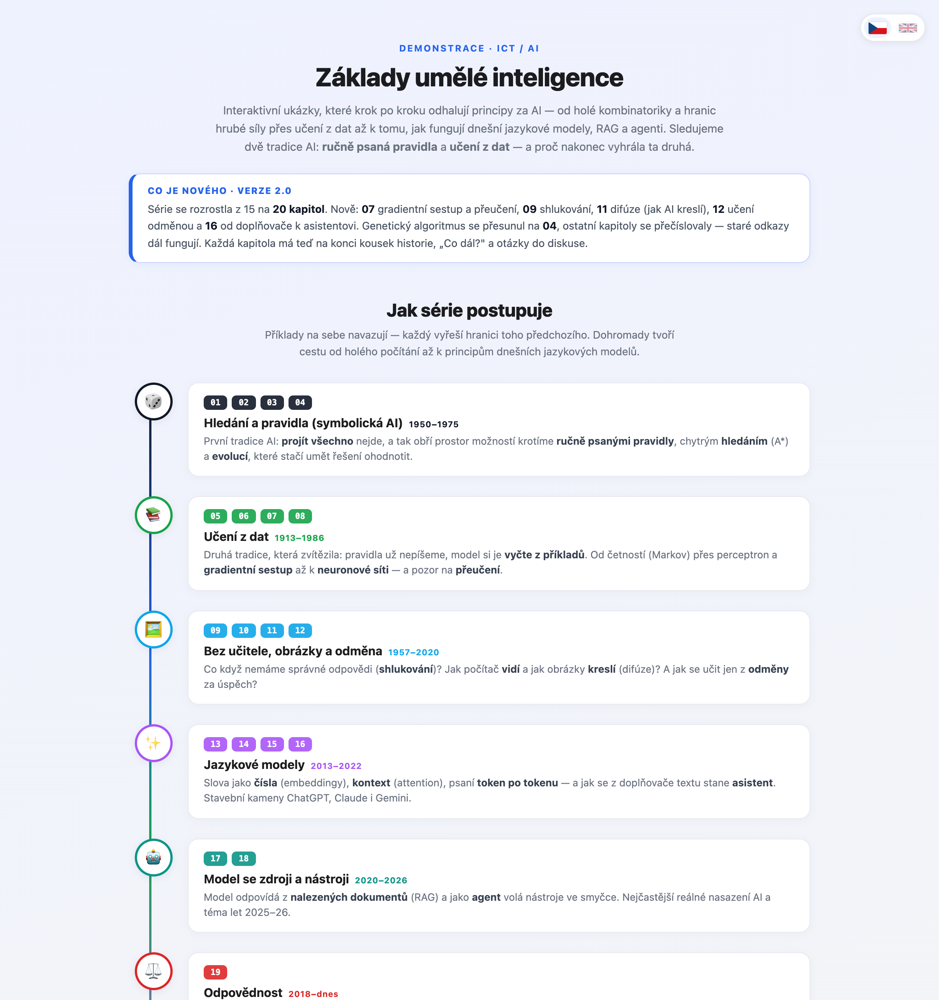

---

## What's new — version 2.0 (September 2026)

- The series grew from 15 to **20 chapters**. New ones: **07** gradient descent and overfitting, **09** clustering, **11** diffusion (how AI draws pictures), **12** learning from reward and **16** from text predictor to assistant.
- The genetic algorithm moved to **04** (it belongs with search), and the other chapters were **renumbered**. Old links still work — they redirect to the new address.
- Attention (**14**) was reworked: pairs of sentences where one word changes where the model looks.
- Every chapter now ends with **a bit of history**, **"What's next?"** and **two questions for discussion**, plus previous/next buttons. The version and the date of the last update are at the bottom of every page.

---

## How to run it

- **Online:** open **[www.saiko.cz/ai](https://www.saiko.cz/ai/)**.
- **From source:**
  1. Clone this repo.
  2. `make setup` (installs Astro), then `make preview` — serves a local copy at http://localhost:8080.
  3. Click the examples in the overview. Each has a **← BACK** button in the top-left and a 🇨🇿/🇬🇧 language toggle in the top-right.

> Everything runs locally in the browser. For visitor stats the site uses **[GoatCounter](https://www.goatcounter.com)** — anonymous, cookieless page views only: no cookies, no personal data, no cross-site tracking (so no consent banner is needed).

---

## How the series progresses

The chapters build on each other — each one solves the limitation of the previous. The series follows two traditions of AI: **hand-written rules** (01–04) and **learning from data** (from 05 on) — and why the second one won:

| Stage | Chapters | What it's about |
|------|----------|-------------|
| 🎲 Search and rules (symbolic AI) | 01–04 | Trying everything is impossible — we tame the space with rules, smart search (A\*) and evolution |
| 📚 Learning from data | 05–08 | The model reads the rules from examples: Markov chain, perceptron, gradient descent and overfitting, neural network |
| 🖼️ No teacher, images and reward | 09–12 | Clustering without labels, how a computer sees and draws (convolution, diffusion), learning from reward |
| ✨ Language models | 13–16 | Words as numbers (embeddings), context (attention), writing token by token, from text predictor to assistant |
| 🤖 A model with sources and tools | 17–18 | RAG answers from retrieved documents; an agent calls tools in a loop |
| ⚖️ Responsibility | 19 | Biased data → a biased model; checking fairness per group |
| 🚚 Bonus — optimization in practice | 20 | The travelling salesman problem solved by evolution (joins 01 and 04) |

---

## The chapters

### 01 · Binary counter 8×8
[→ open `01-binary-counter.html`](https://www.saiko.cz/ai/01-binary-counter.html)

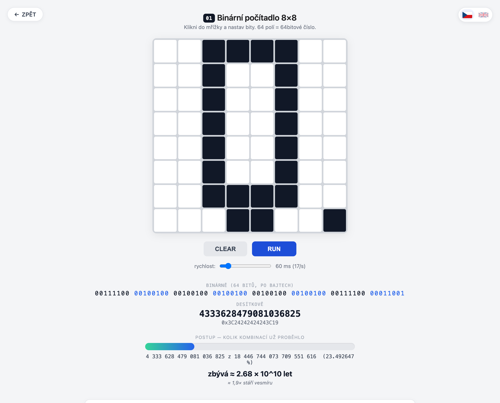

A grid of 64 cells as a single 64-bit number. Click to set bits and press RUN to count up. The remaining-time graph shows why "trying every combination" by brute force **never finishes** — at the demo's pace it's over 35 billion years (longer than the age of the universe), and even at a billion steps per second it would take almost 600 years for a mere 8×8 grid. The perfect motivation for why we don't use brute force in AI.

---

### 02 · From randomness to language
[→ open `02-jazyk.html`](https://www.saiko.cz/ai/02-jazyk.html)

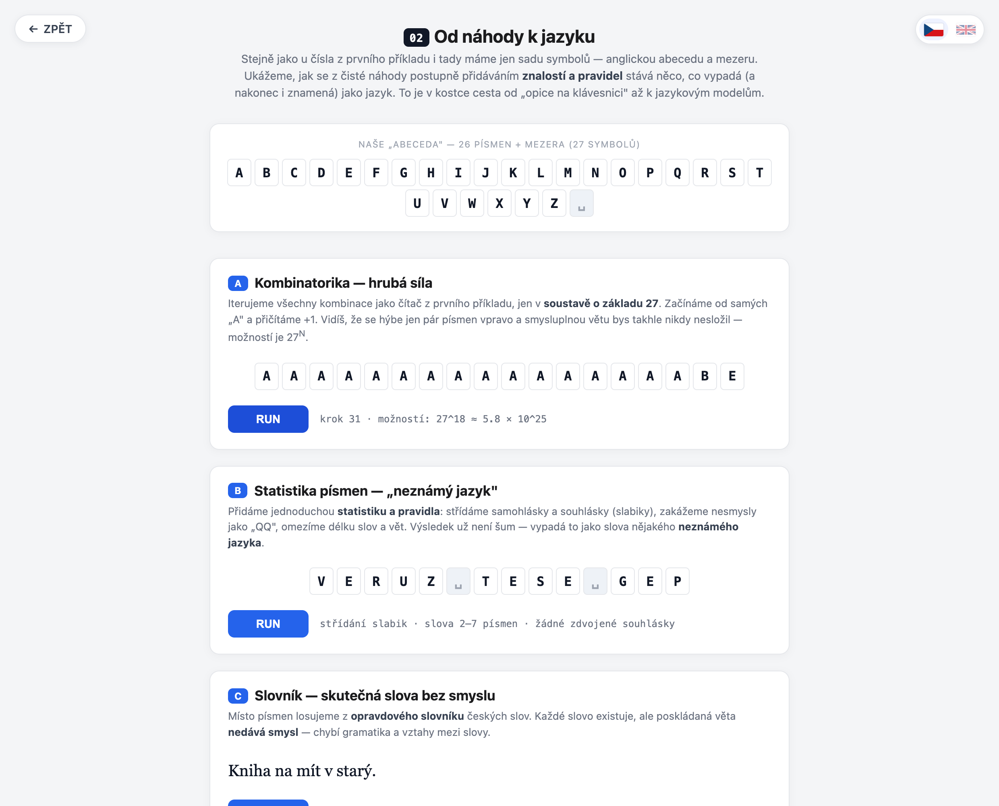

Four steps **A–D** as a mini-history of language models: from combinatorially iterated random letters, through statistics (a pseudo-language with syllables) and a dictionary (real words with no meaning) to grammatically correct, meaningful sentences. By gradually adding rules, noise turns into language.

---

### 03 · Pathfinding instead of brute force
[→ open `03-hledani.html`](https://www.saiko.cz/ai/03-hledani.html)

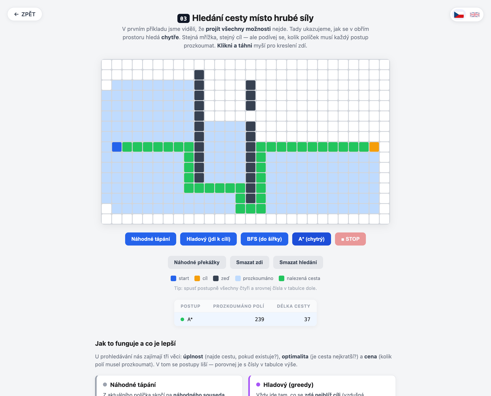

A grid maze (draw walls with the mouse) and a contest of methods: **random walk, greedy, BFS and A\***. You see for yourself how many cells each one explores — and a comparison table shows why brute force gives way to smart search (A\* finds a path as short as BFS but explores far fewer cells — on open ground even an order of magnitude fewer).

---

### 04 · Genetic algorithm
[→ open `04-genetika.html`](https://www.saiko.cz/ai/04-genetika.html)

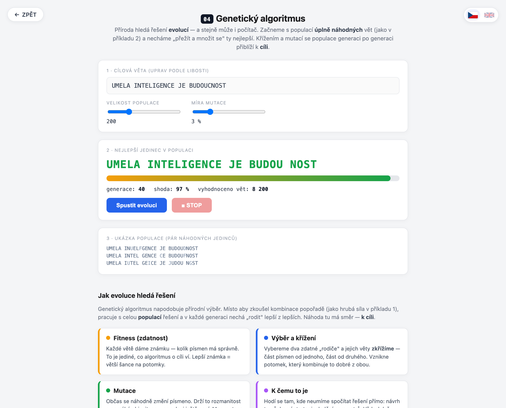

A population of random sentences **evolves toward a target** generation by generation through crossover and mutation. It shows how to search for a solution without knowing it — you only need to be able to score how good it is. It links the randomness of examples 1 and 2 with evolution toward meaning.

---

### 05 · Learning from text — a Markov chain
[→ open `05-markov.html`](https://www.saiko.cz/ai/05-markov.html)


The first demo of **real learning from data**: the model computes from your text what most often follows what, and generates new text from those probabilities. With the context-order slider you watch gibberish turn into almost-real language — the principle of a "small language model".

---

### 06 · Learning from examples — a perceptron
[→ open `06-perceptron.html`](https://www.saiko.cz/ai/06-perceptron.html)

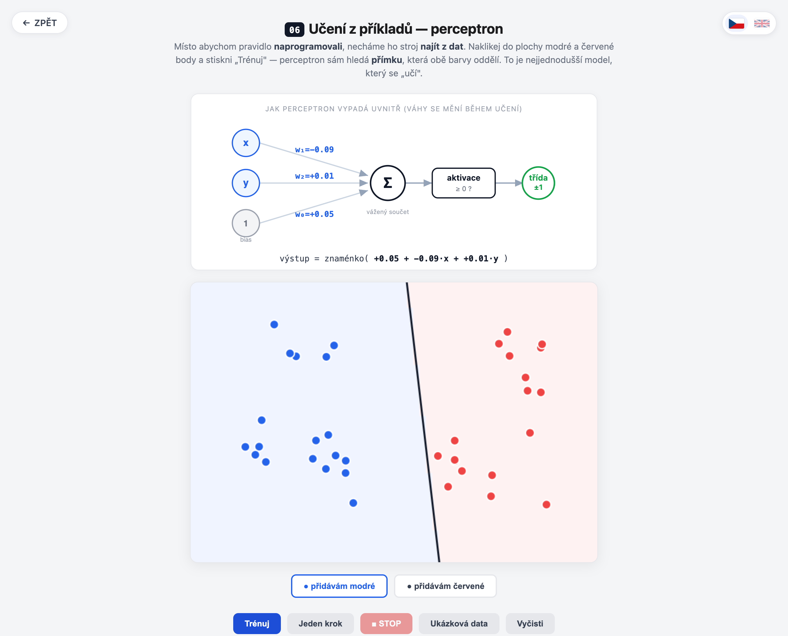

You click two colors of points and the perceptron finds a **separating line** on its own. The neuron diagram above the canvas shows the weights changing live during learning. It demonstrates the difference between "programming a rule" and "letting it be found from data" — and the limit of a linear model (a cross/XOR is too much for it).

---

### 07 · Gradient descent and overfitting
[→ open `07-gradient.html`](https://www.saiko.cz/ai/07-gradient.html)

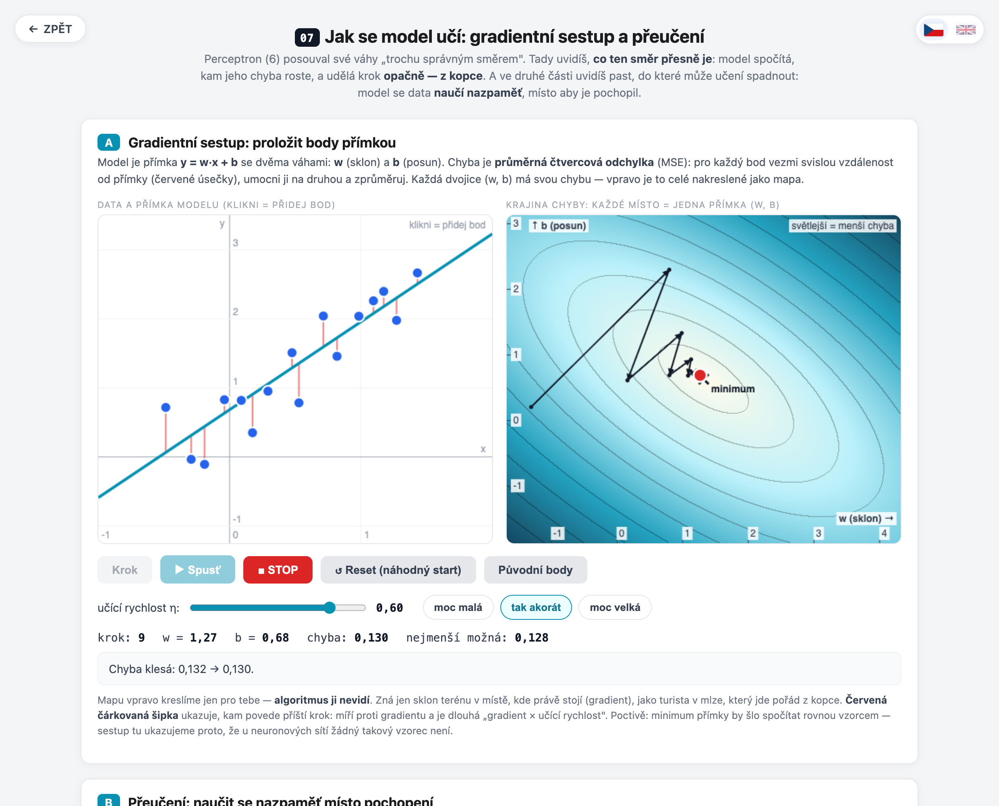

How a model really learns. **Part A:** fitting a line to points — on the right the error (MSE) is drawn as a **landscape** over the two weights, and the model walks downhill step by step; the learning-rate presets show crawling (too small), converging (just right) and blowing up (too big). **Part B:** a polynomial of growing degree on noisy points — the training error keeps falling, but the error on **test points the model never saw** turns up again: that's **overfitting**, learning by heart instead of understanding. The bridge to the neural network (08): backpropagation is just an efficient way to compute this gradient for all the weights.

---

### 08 · A neural network draws the boundary
[→ open `08-neuronka.html`](https://www.saiko.cz/ai/08-neuronka.html)

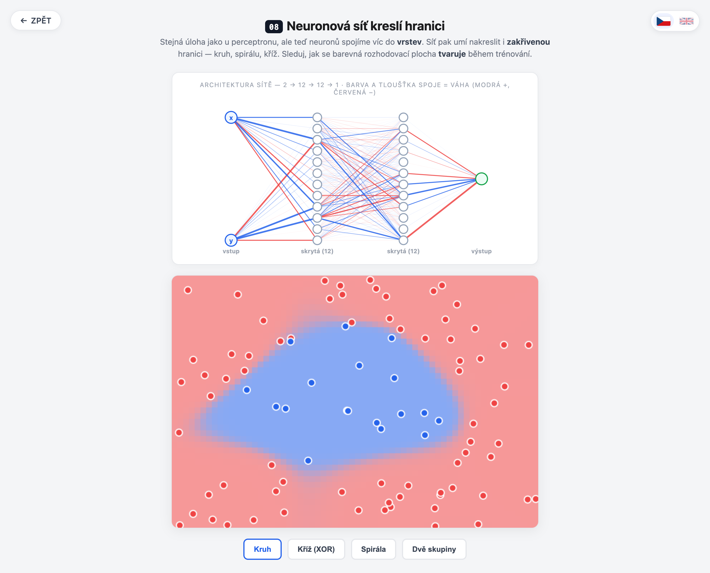

A sequel to #6: a network of neurons (2 → 12 → 12 → 1) handles a **curved** boundary too — a circle, a cross, a spiral. The network diagram colors the connections by their current weights (blue +, red −), so you see the network "rewire" during training. You click in your own data.

---

### 09 · Learning without a teacher — clustering (k-means)
[→ open `09-shluky.html`](https://www.saiko.cz/ai/09-shluky.html)

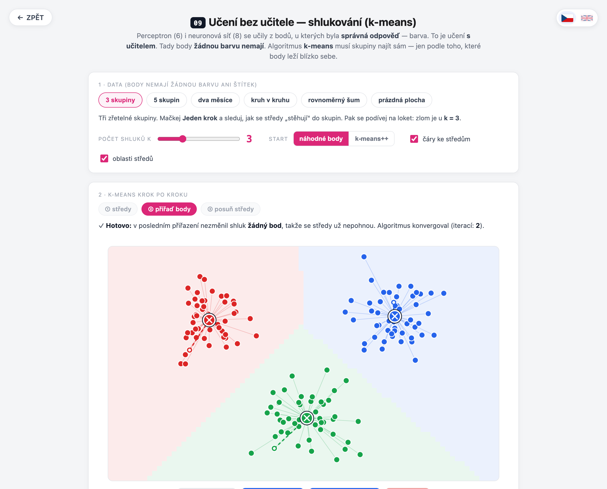

The classifiers in 06 and 08 learned from points with the right answer. Here the points have **no labels at all** and k-means has to find groups by itself — step by step: assign each point to the nearest center, move each center to the mean of its points, repeat. The "elbow" chart helps pick the number of groups; the "two moons" preset shows where k-means fails, and uniform noise shows that it finds groups even where there are none — interpretation is up to a human.

---

### 10 · How a computer sees
[→ open `10-vision.html`](https://www.saiko.cz/ai/10-vision.html)

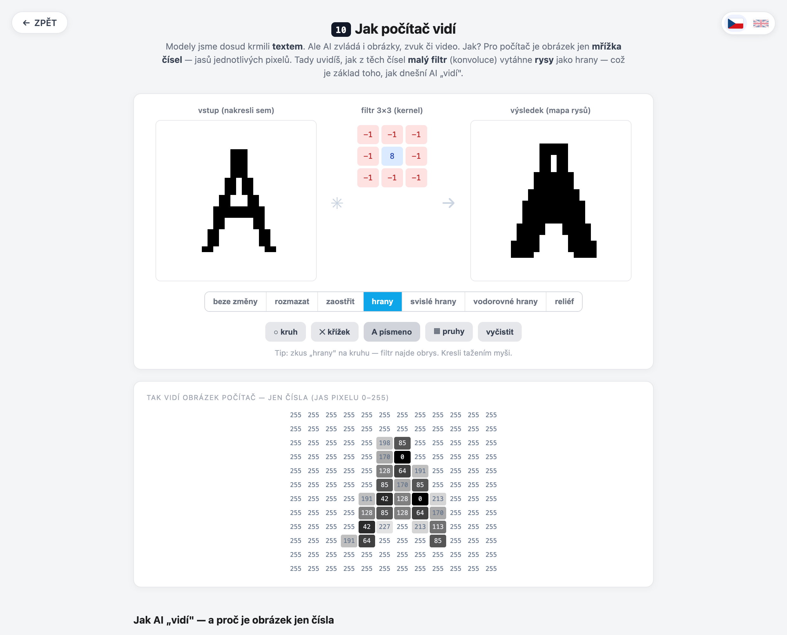

AI isn't only about text — it also handles images, sound and video. How? To a computer an **image is just a grid of numbers** (pixel brightness 0–255). Draw something into the grid (or pick a template) and watch a small **3×3 filter (a convolution)** sweep across it: for each pixel it computes a weighted sum of the neighborhood, pulling out a **feature** — edges, blur, sharpening. Stack thousands of such filters whose values are **learned from data** and you get a **convolutional neural network**, the neural net from example 8 extended to images. And modern **multimodal** models turn an image into the same vectors as words (example 13), so a language model can "see" it.

---

### 11 · Diffusion — how AI draws pictures
[→ open `11-difuze.html`](https://www.saiko.cz/ai/11-difuze.html)

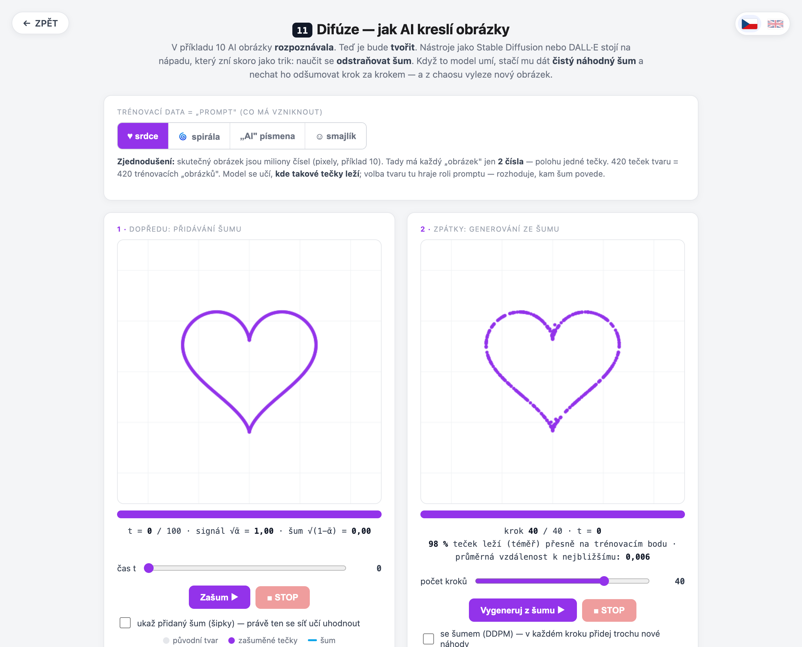

After recognizing images (10), creating them — the principle behind Stable Diffusion and DALL·E. A shape made of dots (heart, spiral, "AI", smiley) is gradually **dissolved into noise**; then, starting from pure noise, the model **removes the noise step by step** until the shape reappears. For clarity the denoiser is computed exactly from the training dots — which is why the result just copies the training data: memorization (07) in its purest form, and the reason for debates about copyright. Real models learn the denoiser with a neural network from billions of images.

---

### 12 · Learning from reward (reinforcement learning)
[→ open `12-odmena.html`](https://www.saiko.cz/ai/12-odmena.html)

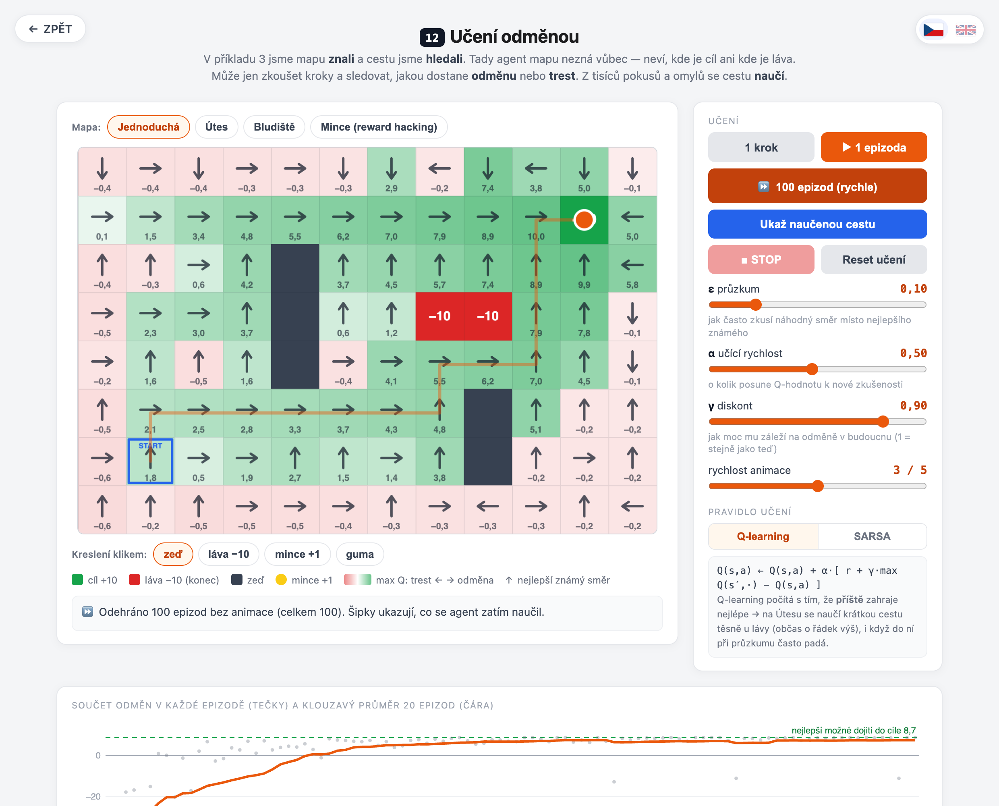

In 03 we knew the map and searched for the path. Here the agent knows **nothing** — it only receives rewards and penalties and learns the way through the maze by **trial and error** (Q-learning from scratch). A heat map of learned values and arrows of the learned policy, an exploration (ε) slider, a reward-per-episode chart and a "cliff" map where the agent weighs a short risky path against a safe detour. The same principle taught AlphaGo to play go — and tunes today's language models (16).

---

### 13 · Tokenization and embeddings
[→ open `13-embeddingy.html`](https://www.saiko.cz/ai/13-embeddingy.html)

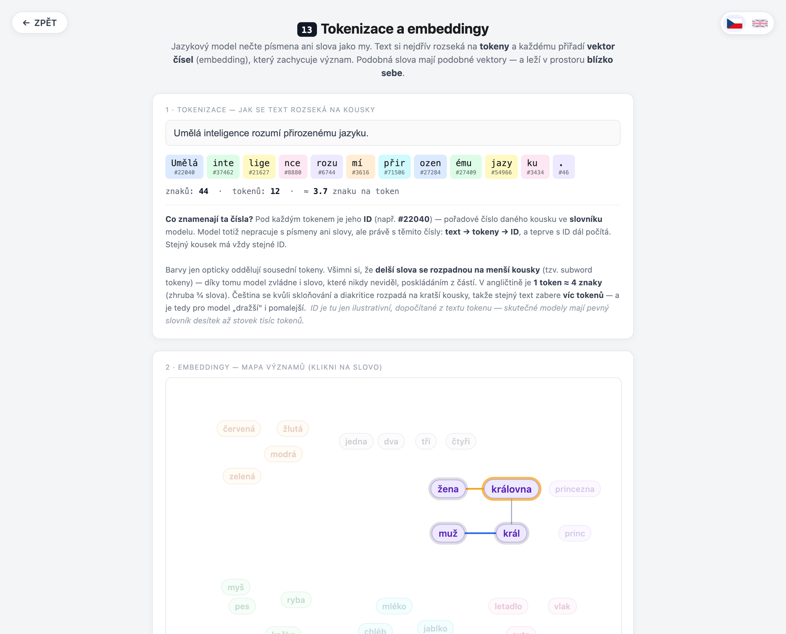

How an LLM "sees" text: chopping it into **tokens** (with IDs from a vocabulary) and a 2D **map of meaning** where similar words lie close. Including computing with meaning — analogies like **king − man + woman = queen** or **two − one + three = four**, drawn as vectors on the map.

---

### 14 · Attention — what the model looks at
[→ open `14-attention.html`](https://www.saiko.cz/ai/14-attention.html)

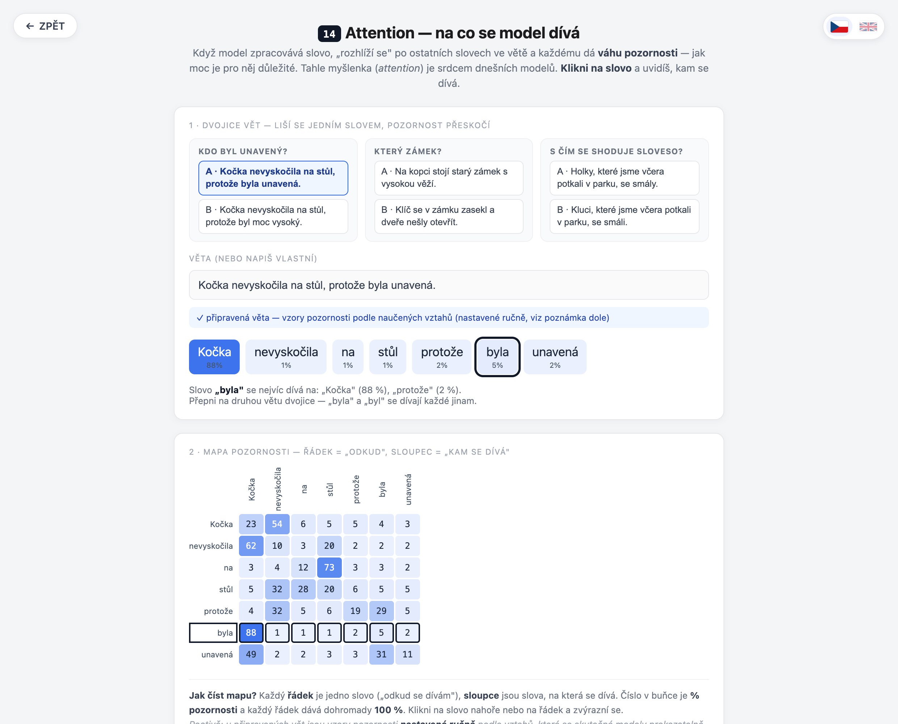

Pairs of sentences that differ by a single word — and the attention of the key word jumps elsewhere: in *"the cat did not jump on the table because **it** was tired / too high"* "it" looks at the cat or at the table; *"river bank / bank account"* resolves which bank is meant; a verb at the end agrees with its subject far back at the start. Percentages, color saturation and the full attention map (matrix). The patterns for the prepared sentences are set by hand to match relations real models learn (stated on the page); for your own sentence only a rough closeness-based guess is shown. The mechanism behind today's transformers.

---

### 15 · How an LLM writes — next-token prediction
[→ open `15-token.html`](https://www.saiko.cz/ai/15-token.html)


Real language models don't blurt out a finished answer — they write it **token by token**. At each step the model computes a probability for every possible next word and **samples** one. This demo shows that step live: a probability bar chart, an editable prompt, and **temperature / top-k / top-p** controls that change how boldly it samples — with a small built-in word model (like the Markov chain in 05) under the hood. It also shows **why models hallucinate**: even when unsure (a flat distribution or an unknown context) the model still confidently picks something. The synthesis of the LLM arc — meaning (13) + context (14) → generation.

---

### 16 · From text predictor to assistant
[→ open `16-asistent.html`](https://www.saiko.cz/ai/16-asistent.html)


Chapter 15 showed that a model only samples the next token. So why does ChatGPT answer a question instead of just continuing the text? Three stages: **pretraining** (a base model continues text — a quiz question gets followed by more questions), **fine-tuning on conversations** (a chat template with roles; the model answers), and **learning from human feedback (RLHF)** — you pick the better of two answers and the model's probabilities shift (and if raters reward flattery, it learns to flatter). Plus "reasoning" models that think step by step before answering, and why it all took off only now (scale).

---

### 17 · RAG — a model with sources
[→ open `17-rag.html`](https://www.saiko.cz/ai/17-rag.html)


A language model only knows what it learned during training — and sounds confident even when it doesn't. **RAG** (retrieval-augmented generation) fixes this: faced with a question, the model first **retrieves** the most relevant document from a knowledge base (by similarity — the embeddings idea from 13) and then answers **from it**. The demo puts the two answers side by side: the model **alone** (it guesses and hallucinates the made-up facts) vs **model + RAG** (it ranks the documents by similarity, attaches the best one, and gives a grounded, source-backed answer). RAG is by far the most common real-world way to deploy an LLM over your own data.

---

### 18 · Agents — a model that acts
[→ open `18-agents.html`](https://www.saiko.cz/ai/18-agents.html)


So far the model only **wrote text**. An **agent** is the equation **model + memory + tools + planning**: given a task, it runs a **reason → act → observe** loop — it decides which tool to call (a calculator, search over a knowledge base, a calendar, send-email), calls it, remembers the result, and plans the next step, repeating until the task is done. The demo shows the full trace and includes a **multi-step** task ("find the Wi-Fi password and email it") where the agent chains *search → email*, carrying the result in memory. The tools really run and the loop is real; the "reasoning" is an illustrative keyword planner. It ties the whole series together — and it's the direction AI took in 2026 (tool use / MCP). With autonomy comes the need for limits and human oversight.

---

### 19 · Biased data, biased model
[→ open `19-bias.html`](https://www.saiko.cz/ai/19-bias.html)

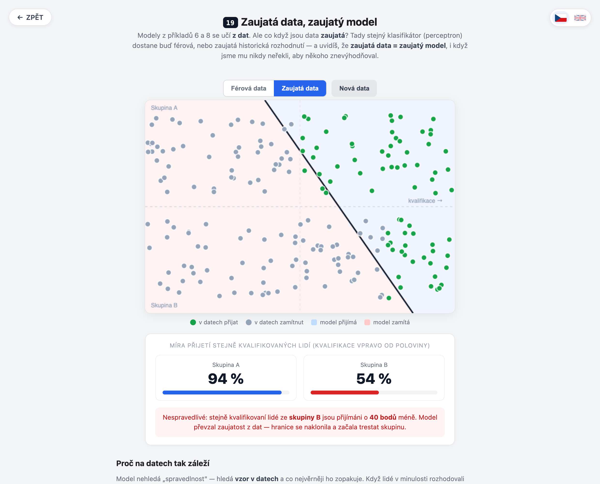

The classifiers in 06–08 learn from data — so **what happens when the data is biased?** The same perceptron is trained on either fair or biased historical decisions. With fair data the decision boundary is vertical (only qualification matters); with biased data — where one group was historically held to a higher bar — the boundary **tilts**, and equally qualified people from that group get rejected. A per-group acceptance-rate readout makes the unfairness explicit. The model never "meant" to discriminate; it just faithfully copied the pattern in the data — which is exactly why bias in AI is so easy to miss. Applies to LLMs too.

---

### 20 · The travelling salesman problem (TSP) — bonus
[→ open `20-tsp.html`](https://www.saiko.cz/ai/20-tsp.html) · [app ↗](https://saiko.cz/tsp/) · [source code ↗](https://github.com/dsaiko/tsp)

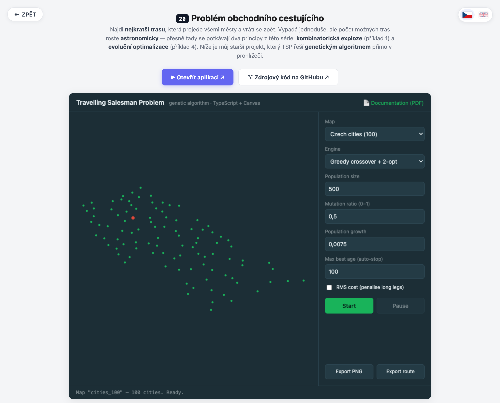

A bonus card with an embedded older project: a **TSP visualizer that solves the shortest route through all the cities with a genetic algorithm** right in the browser. It joins two principles of this series — **combinatorial explosion** (there are `(n−1)!/2` routes, going through them all is impossible) and **evolution** (a population of routes crosses over and mutates toward better ones), plus the **2-opt** heuristic (uncrossing edges). Built in TypeScript + Canvas + Web Workers, 12 maps including real Czech cities. It's a modernized rewrite of the original Java app from 2006.

---

## Implementation notes

- **Self-contained output** — built with [Astro](https://astro.build) from `.astro` sources in `src/pages/`; each generated page is a single `.html` with **inline CSS and JS and no external assets**, so it works under any sub-path and even via `file://`. Shared chrome (language toggle, back button, shared demo styles, the chapter footer with history, "What's next?", discussion questions and previous/next navigation, and the version line) lives once in `src/layouts/Layout.astro`. Everything about the chapters is in one data file, `src/data/chapters.js` — the overview and every chapter footer are generated from it; adding a chapter is one entry plus one `.astro` file. Old addresses from before the renumbering redirect via `src/pages/[stara].astro`.
- **Bilingual in one file** — Czech and English content live side by side; a flag toggle (top-right) switches them instantly with no reload, and the choice is saved to `localStorage`. You can deep-link a language with `?lang=en` / `?lang=cs`.
- **Exact arithmetic** — the counter in example 1 uses `BigInt`, because a normal JS number is only exact up to 53 bits.
- **From-scratch implementations** — the neural network (incl. backpropagation), gradient descent and least squares, the Markov chain, A\*/BFS, the genetic algorithm, k-means, convolution, diffusion, Q-learning and attention are all written from the ground up, without ML libraries, so the principle is visible in the code.
- Some demos are **simplified illustrations** rather than trained models — the embedding map (13), the hand-set attention patterns (14), the keyword-matching retrieval (17) and the agent's keyword planner (18). Each page says so explicitly.

---

## Deployment

The site is static; it's deployed to S3 + CloudFront via the `Makefile` (configuration in `Makefile.local`, outside git):

```bash
make setup              # install dependencies (Astro), one-off
make build              # astro build: src/pages/*.astro → dist/
make test               # build + smoke test in Chrome (JS errors, mobile overflow, regressions)
make preview            # local preview at http://localhost:8080
make deploy             # build → test → sync to S3 → CloudFront invalidation
make deploy-s3-dryrun   # deploy dry run
```

`make test` uses the locally installed Google Chrome (`CHROME_PATH=…` for another one); before a lecture it confirms in about a minute that every demo loads and works in both languages on desktop and mobile.

---

*SSST 2026 · ICT / AI · [www.saiko.cz/ai](https://www.saiko.cz/ai/)*

---

<a id="česky"></a>
# Základy umělé inteligence — interaktivní ukázky

🇨🇿 **Česky** &nbsp;·&nbsp; 🇬🇧 **[English ↑](#english)**

Sada interaktivních demonstrací v čistém HTML/JavaScriptu, které **krok po kroku odhalují principy za AI** — ve 20 kapitolách, od holé kombinatoriky a hranic hrubé síly přes učení z dat, obrázky a odměnu až k tomu, jak fungují dnešní jazykové modely, RAG a agenti. Jsou dělané pro živý výklad ve třídě: každá kapitola končí kouskem historie, „Co dál?“ a otázkami do diskuse.

Dema jsou čisté HTML/CSS/JS, poskládaná do soběstačných statických stránek pomocí **[Astro](https://astro.build)**. Otevři **[živou verzi](https://www.saiko.cz/ai/)**, nebo si web sestav ze zdrojů (níže).

> 🌐 **Dvojjazyčné:** web je **výchozí v češtině**; na **angličtinu** přepneš vlajkami v pravém horním rohu každé stránky (volba se pamatuje, případně ji nastaví `?lang=en`).

### 🌐 Živá verze: **[www.saiko.cz/ai](https://www.saiko.cz/ai/)**


---

## Co je nového — verze 2.0 (září 2026)

- Série se rozrostla z 15 na **20 kapitol**. Nové jsou: **07** gradientní sestup a přeučení, **09** shlukování, **11** difúze (jak AI kreslí obrázky), **12** učení odměnou a **16** od doplňovače textu k asistentovi.
- Genetický algoritmus se přesunul na **04** (patří k hledání) a ostatní kapitoly se **přečíslovaly**. Staré odkazy dál fungují — přesměrují na novou adresu.
- Attention (**14**) je přepracovaná: dvojice vět, ve kterých jedno slovo změní, kam se model dívá.
- Každá kapitola má teď na konci **kousek historie**, **„Co dál?“** a **dvě otázky do diskuse** a tlačítka předchozí/další. Dole na každé stránce je verze a datum poslední aktualizace.

---

## Jak to spustit

- **Online:** otevři **[www.saiko.cz/ai](https://www.saiko.cz/ai/)**.
- **Ze zdrojů:**
  1. Naklonuj repozitář.
  2. `make setup` (nainstaluje Astro), pak `make preview` — spustí lokální kopii na http://localhost:8080.
  3. Klikej v rozcestníku na jednotlivé příklady. Každý má vlevo nahoře tlačítko **← ZPĚT** a vpravo nahoře přepínač jazyka 🇨🇿/🇬🇧.

> Vše běží lokálně v prohlížeči. Pro statistiku návštěvnosti web používá **[GoatCounter](https://www.goatcounter.com)** — jen anonymní, bezcookie zobrazení stránek: žádné cookies, žádná osobní data, žádné sledování napříč weby (proto bez lišty na souhlas).

---

## Jak série postupuje

Kapitoly na sebe navazují — každá vyřeší hranici té předchozí. Série sleduje dvě tradice AI: **ručně psaná pravidla** (01–04) a **učení z dat** (od 05) — a proč nakonec vyhrála ta druhá:

| Etapa | Kapitoly | O čem to je |
|------|----------|-------------|
| 🎲 Hledání a pravidla (symbolická AI) | 01–04 | Projít všechno nejde — prostor krotíme pravidly, chytrým hledáním (A\*) a evolucí |
| 📚 Učení z dat | 05–08 | Model si pravidla vyčte z příkladů: Markovův řetězec, perceptron, gradientní sestup a přeučení, neuronová síť |
| 🖼️ Bez učitele, obrázky a odměna | 09–12 | Shlukování bez štítků, jak počítač vidí a kreslí (konvoluce, difúze), učení odměnou |
| ✨ Jazykové modely | 13–16 | Slova jako čísla (embeddingy), kontext (attention), psaní token po tokenu, od doplňovače k asistentovi |
| 🤖 Model se zdroji a nástroji | 17–18 | RAG odpovídá z nalezených dokumentů; agent ve smyčce volá nástroje |
| ⚖️ Odpovědnost | 19 | Zaujatá data → zaujatý model; kontrola spravedlnosti po skupinách |
| 🚚 Bonus — optimalizace v praxi | 20 | Problém obchodního cestujícího řešený evolucí (spojuje 01 a 04) |

---

## Kapitoly

### 01 · Binární počítadlo 8×8
[→ otevřít `01-binary-counter.html`](https://www.saiko.cz/ai/01-binary-counter.html)


Mřížka 64 polí jako jedno 64bitové číslo. Klikáním nastavíš bity a tlačítkem RUN je necháš přičítat. Graf zbývajícího času ukazuje, proč „projít všechny kombinace" hrubou silou **nikdy nedoběhne** — tempem dema přes 35 miliard let (víc než stáří vesmíru) a i při miliardě kroků za sekundu by to pro pouhou mřížku 8×8 trvalo skoro 600 let. Ideální motivace, proč v AI hrubou silu nepoužíváme.

---

### 02 · Od náhody k jazyku
[→ otevřít `02-jazyk.html`](https://www.saiko.cz/ai/02-jazyk.html)


Čtyři kroky **A–D** jako mini-historie jazykových modelů: od kombinatoricky iterovaných náhodných písmen, přes statistiku (pseudojazyk se slabikami) a slovník (skutečná slova bez smyslu) až po gramaticky správné, smysluplné věty. Postupným přidáváním pravidel se z šumu stává jazyk.

---

### 03 · Hledání cesty místo hrubé síly
[→ otevřít `03-hledani.html`](https://www.saiko.cz/ai/03-hledani.html)


Bludiště na mřížce (zdi kreslíš myší) a souboj postupů: **náhodné tápání, hladový, BFS a A\***. Vidíš na vlastní oči, kolik políček každý prozkoumá — a srovnávací tabulka ukáže, proč se hrubá síla nahrazuje chytrým prohledáváním (A\* najde stejně krátkou cestu jako BFS, ale prozkoumá výrazně méně — na volné ploše i řádově).

---

### 04 · Genetický algoritmus
[→ otevřít `04-genetika.html`](https://www.saiko.cz/ai/04-genetika.html)


Populace náhodných vět se křížením a mutací generaci po generaci **vyvíjí k cíli**. Ukazuje, jak hledat řešení, aniž bychom ho znali — stačí umět ohodnotit, jak je dobré. Propojuje náhodu z příkladů 1 a 2 s evolucí směrem ke smyslu.

---

### 05 · Učení z textu — Markovův řetězec
[→ otevřít `05-markov.html`](https://www.saiko.cz/ai/05-markov.html)


První ukázka **skutečného učení z dat**: model si z vloženého textu spočítá, co po čem nejčastěji následuje, a podle těch pravděpodobností generuje nový text. Posuvníkem řádu kontextu uvidíš, jak z blábolu vzniká skoro čeština — princip „malého jazykového modelu".

---

### 06 · Učení z příkladů — perceptron
[→ otevřít `06-perceptron.html`](https://www.saiko.cz/ai/06-perceptron.html)


Naklikáš dvě barvy bodů a perceptron sám hledá **dělicí přímku**. Schéma neuronu nad plochou ukazuje živě se měnící váhy během učení. Demonstruje rozdíl mezi „naprogramovat pravidlo" a „nechat ho najít z dat" — i hranici lineárního modelu (na kříž/XOR nestačí).

---

### 07 · Gradientní sestup a přeučení
[→ otevřít `07-gradient.html`](https://www.saiko.cz/ai/07-gradient.html)


Jak se model doopravdy učí. **Část A:** proložení bodů přímkou — vpravo je chyba (MSE) nakreslená jako **krajina** nad dvěma vahami a model po ní krok za krokem sestupuje z kopce; předvolby učící rychlosti ukážou plazení (moc malá), rychlé dojití do minima (tak akorát) a rozletění (moc velká). **Část B:** polynom rostoucího stupně na zašuměných bodech — trénovací chyba pořád klesá, ale chyba na **testovacích bodech, které model neviděl**, začne růst: to je **přeučení**, naučit se nazpaměť místo pochopení. Most k neuronové síti (08): backpropagation je jen efektivní výpočet tohohle gradientu pro všechny váhy.

---

### 08 · Neuronová síť kreslí hranici
[→ otevřít `08-neuronka.html`](https://www.saiko.cz/ai/08-neuronka.html)


Pokračování perceptronu (06): síť neuronů (2 → 12 → 12 → 1) zvládne i **zakřivenou** hranici — kruh, kříž, spirálu. Schéma sítě barví spoje podle aktuálních vah (modrá +, červená −), takže vidíš, jak se síť během tréninku „přepojuje". Vlastní data si naklikáš sám.

---

### 09 · Učení bez učitele — shlukování (k-means)
[→ otevřít `09-shluky.html`](https://www.saiko.cz/ai/09-shluky.html)


Klasifikátory v 06 a 08 se učily z bodů se správnou odpovědí. Tady body **žádné štítky nemají** a k-means musí skupiny najít sám — krok po kroku: přiřaď body nejbližšímu středu, posuň středy do průměru jejich bodů, opakuj. Graf „loket“ pomůže zvolit počet skupin; předvolba „dva měsíce“ ukáže, kde k-means selže, a rovnoměrný šum, že skupiny „najde“ i tam, kde žádné nejsou — výklad je na člověku.

---

### 10 · Jak počítač vidí
[→ otevřít `10-vision.html`](https://www.saiko.cz/ai/10-vision.html)


AI není jen o textu — zvládá i obrázky, zvuk a video. Jak? Pro počítač je **obrázek jen mřížka čísel** (jas pixelu 0–255). Nakresli něco do mřížky (nebo zvol předlohu) a sleduj, jak po ní přejíždí malý **filtr 3×3 (konvoluce)**: pro každý pixel spočítá vážený součet okolí a vytáhne tak určitý **rys** — hrany, rozmazání, zaostření. Navrstvením tisíců takových filtrů, jejichž hodnoty se síť **naučí z dat**, vznikne **konvoluční neuronová síť** — neuronka z příkladu 8 rozšířená na obrázky. A moderní **multimodální** modely převedou obrázek na stejné vektory jako slova (příklad 13), takže ho jazykový model „vidí".

---

### 11 · Difúze — jak AI kreslí obrázky
[→ otevřít `11-difuze.html`](https://www.saiko.cz/ai/11-difuze.html)


Po rozpoznávání obrázků (10) jejich tvorba — princip za Stable Diffusion a DALL·E. Tvar z teček (srdce, spirála, „AI“, smajlík) se postupně **rozpustí v šumu**; pak model z čistého šumu **krok za krokem šum odebírá**, až se tvar znovu objeví. Odšumovač tu pro názornost počítáme přesně z trénovacích teček — proto výsledek jen kopíruje trénovací data: zapamatování (07) v čisté podobě a důvod sporů o autorská práva. Skutečné modely se odšumování učí neuronovou sítí z miliard obrázků.

---

### 12 · Učení odměnou (reinforcement learning)
[→ otevřít `12-odmena.html`](https://www.saiko.cz/ai/12-odmena.html)


V 03 jsme mapu znali a cestu hledali. Tady agent **nezná nic** — dostává jen odměny a tresty a cestu bludištěm se naučí **pokusem a omylem** (Q-learning od nuly). Teplotní mapa naučených hodnot a šipky naučené politiky, posuvník průzkumu (ε), graf odměny za epizodu a mapa „útes“, kde agent volí mezi krátkou riskantní cestou a bezpečnou oklikou. Stejný princip naučil AlphaGo hrát go — a dolaďuje dnešní jazykové modely (16).

---

### 13 · Tokenizace a embeddingy
[→ otevřít `13-embeddingy.html`](https://www.saiko.cz/ai/13-embeddingy.html)


Jak LLM „vidí" text: rozsekání na **tokeny** (s ID ze slovníku) a 2D **mapa významů**, kde podobná slova leží blízko. Včetně počítání s významy — analogie jako **král − muž + žena = královna** nebo **dva − jedna + tři = čtyři**, vykreslené jako vektory na mapě.

---

### 14 · Attention — na co se model dívá
[→ otevřít `14-attention.html`](https://www.saiko.cz/ai/14-attention.html)


Dvojice vět, které se liší jediným slovem — a pozornost klíčového slova přeskočí jinam: ve *„Kočka nevyskočila na stůl, protože **byla** unavená / **byl** moc vysoký“* se tvar slovesa dívá na kočku, nebo na stůl; *„zámek s věží / klíč v zámku“* rozhodne, který zámek je myšlen; sloveso na konci se shoduje s podmětem daleko na začátku. Procenta, sytost barvy a celá mapa pozornosti (matice). Vzory u připravených vět jsou nastavené ručně podle vztahů, které se skutečné modely učí (na stránce je to přiznané); u vlastní věty je jen hrubý odhad podle blízkosti. Mechanismus za dnešními transformery.

---

### 15 · Jak LLM píše — predikce dalšího tokenu
[→ otevřít `15-token.html`](https://www.saiko.cz/ai/15-token.html)


Skutečné jazykové modely nevyhrknou hotovou odpověď — píšou ji **token po tokenu**. V každém kroku spočítají pravděpodobnost pro každé možné další slovo a jedno **losují**. Ukázka to zobrazí naživo: sloupcový graf pravděpodobností, editovatelný začátek věty a ovládání **teploty / top-k / top-p**, které mění, jak odvážně model losuje — pod kapotou běží malý slovní model (jako Markov ve 5). Zároveň ukazuje, **proč modely halucinují**: i když si není jistý (ploché rozdělení nebo neznámý kontext), model stejně sebevědomě něco vybere. Vyvrcholení linie o LLM — význam (13) + kontext (14) → generování.

---

### 16 · Od doplňovače textu k asistentovi
[→ otevřít `16-asistent.html`](https://www.saiko.cz/ai/16-asistent.html)


Kapitola 15 ukázala, že model jen losuje další token. Proč tedy ChatGPT na otázku odpoví, místo aby jen pokračoval v textu? Tři fáze: **předtrénink** (základní model doplňuje text — za kvízovou otázku přidá další otázky), **doladění na konverzacích** (chat šablona s rolemi; model odpovídá) a **učení z lidského hodnocení (RLHF)** — vybíráš lepší ze dvou odpovědí a pravděpodobnosti modelu se posouvají (a když hodnotitelé odměňují lichotky, naučí se lichotit). Navíc „uvažující“ modely, které před odpovědí přemýšlejí krok za krokem, a proč to celé přišlo až teď (měřítko).

---

### 17 · RAG — model se zdroji
[→ otevřít `17-rag.html`](https://www.saiko.cz/ai/17-rag.html)


Jazykový model umí jen to, co se naučil při tréninku — a tváří se sebejistě, i když něco neví. **RAG** (vyhledáním rozšířená generace) to řeší: na otázku model nejdřív **vyhledá** nejrelevantnější dokument ze znalostní báze (podle podobnosti — princip embeddingů z 13) a teprve pak odpoví **z něj**. Ukázka staví obě odpovědi vedle sebe: **jen model** (tipne si a vymyšlené údaje halucinuje) vs **model + RAG** (seřadí dokumenty podle podobnosti, ten nejlepší přiloží a dá odpověď podloženou zdrojem). RAG je dnes zdaleka nejčastější způsob, jak nasadit LLM nad vlastní data.

---

### 18 · Agenti — model, který jedná
[→ otevřít `18-agents.html`](https://www.saiko.cz/ai/18-agents.html)


Dosud model jen **psal text**. **Agent** je rovnice **model + paměť + nástroje + plánování**: dostane úkol a běží ve smyčce **úvaha → akce → pozorování** — sám se rozhodne, který nástroj zavolat (kalkulačka, vyhledávání ve znalostní bázi, kalendář, odeslání e-mailu), zavolá ho, výsledek si zapamatuje a naplánuje další krok, dokud úkol nesplní. Ukázka zobrazí celou trasu a obsahuje i **vícekrokový** úkol („zjisti heslo na Wi-Fi a pošli ho e-mailem"), kde agent zřetězí *vyhledání → e-mail* a mezivýsledek si nese v paměti. Nástroje opravdu běží a smyčka je reálná; „uvažování" je ukázkový plánovač podle klíčových slov. Spojuje celou sérii dohromady — a je to směr, kterým se AI vydala v roce 2026 (tool use / MCP). S autonomií roste i potřeba limitů a lidského dohledu.

---

### 19 · Zaujatá data, zaujatý model
[→ otevřít `19-bias.html`](https://www.saiko.cz/ai/19-bias.html)


Klasifikátory z 06–08 se učí z dat — a **co když jsou data zaujatá?** Stejný perceptron se natrénuje buď na férových, nebo na zaujatých historických rozhodnutích. U férových dat je dělicí hranice svislá (rozhoduje jen kvalifikace); u zaujatých — kde jedna skupina musela historicky splnit víc — se hranice **nakloní** a stejně kvalifikovaní lidé z té skupiny neprojdou. Míra přijetí po skupinách dělá nespravedlnost viditelnou. Model nikdy „nechtěl" diskriminovat; jen věrně zopakoval vzor z dat — a právě proto se zaujatost v AI tak snadno přehlédne. Týká se i LLM.

---

### 20 · Problém obchodního cestujícího (TSP) — bonus
[→ otevřít `20-tsp.html`](https://www.saiko.cz/ai/20-tsp.html) · [aplikace ↗](https://saiko.cz/tsp/) · [zdrojový kód ↗](https://github.com/dsaiko/tsp)


Bonusová karta s vloženým starším projektem: **vizualizér TSP řešící nejkratší trasu přes všechna města genetickým algoritmem** přímo v prohlížeči. Spojuje dva principy z této série — **kombinatorickou explozi** (tras je `(n−1)!/2`, projít všechny nejde) a **evoluci** (populace tras se kříží a mutuje k lepšímu), doplněnou o heuristiku **2-opt** (odkřížení hran). Postaveno v TypeScriptu + Canvas + Web Workers, 12 map včetně reálných českých měst. Je to modernizovaný přepis původní Java aplikace z roku 2006.

---

## Poznámky k implementaci

- **Soběstačný výstup** — generováno [Astrem](https://astro.build) ze zdrojů `.astro` v `src/pages/`; každá vygenerovaná stránka je jeden `.html` s **inline CSS i JS a bez externích assetů**, takže funguje pod libovolnou pod-cestou i přes `file://`. Sdílený chrome (přepínač jazyka, tlačítko zpět, společné styly dem, patička kapitoly s historií, „Co dál?“, otázkami do diskuse a navigací předchozí/další a řádek s verzí) žije jednou v `src/layouts/Layout.astro`. Vše o kapitolách je v jednom datovém souboru `src/data/chapters.js` — generuje se z něj rozcestník i patička každé kapitoly; přidání kapitoly je jeden záznam plus jeden soubor `.astro`. Staré adresy z doby před přečíslováním přesměrovává `src/pages/[stara].astro`.
- **Dvojjazyčné v jednom souboru** — česká i anglická verze jsou vedle sebe; přepínač s vlajkami (vpravo nahoře) je přepne okamžitě bez načítání stránky a volba se uloží do `localStorage`. Jazyk lze předvolit i přes `?lang=en` / `?lang=cs`.
- **Přesná aritmetika** — počítadlo v příkladu 1 používá `BigInt`, protože běžné JS číslo je přesné jen do 53 bitů.
- **Vlastní implementace** — neuronová síť (vč. backpropagation), gradientní sestup a nejmenší čtverce, Markovův řetězec, A\*/BFS, genetický algoritmus, k-means, konvoluce, difúze, Q-learning i attention jsou napsané od základu, bez ML knihoven, aby šel princip vidět v kódu.
- Některá dema jsou **zjednodušené ilustrace**, ne natrénované modely — mapa embeddingů (13), ručně nastavené vzory pozornosti (14), vyhledávání podle společných slov (17) a plánovač agenta podle klíčových slov (18). Každá stránka to výslovně uvádí.

---

## Nasazení

Web je statický, nasazuje se na S3 + CloudFront pomocí `Makefile` (konfigurace v `Makefile.local`, mimo git):

```bash
make setup              # instalace závislostí (Astro), jednorázově
make build              # astro build: src/pages/*.astro → dist/
make test               # build + smoke test v Chromu (chyby JS, přetečení na mobilu, regrese)
make preview            # lokální náhled na http://localhost:8080
make deploy             # build → test → sync na S3 → invalidace CloudFront
make deploy-s3-dryrun   # zkouška deploye nanečisto
```

`make test` používá lokálně nainstalovaný Google Chrome (jiný přes `CHROME_PATH=…`); před přednáškou zhruba za minutu ověří, že se všechna dema načtou a fungují v obou jazycích na desktopu i mobilu.

---

*SSST 2026 · ICT / AI · [www.saiko.cz/ai](https://www.saiko.cz/ai/)*
